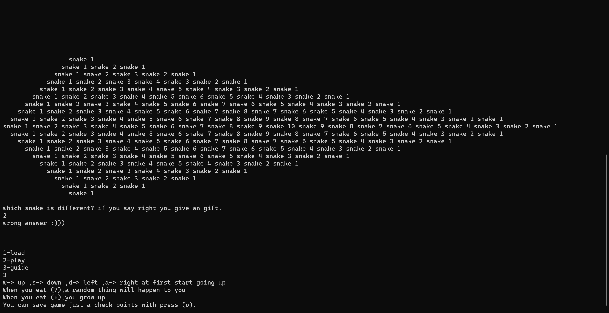
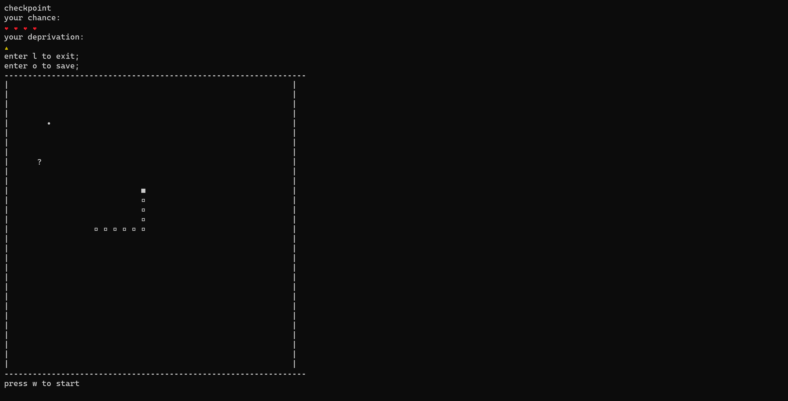

# dOXology oDyssey
## The Nostalgia Snake Game
This is a console-based implementation of the classic Snake game, written in C++. The game allows the player to control a snake and move it around a rectangular board while trying to eat as many apples as possible without colliding with the walls or the snake's body.

## Requirements
This program requires a C++ compiler and the following libraries:

- `bits/stdc++.h`
- `conio.h`
- `stdlib.h`
- `time.h`
- `fstream`
- `unistd.h`
- `windows.h`
## How to Use
To run the program, compile the source code and execute the resulting executable file. The game will start and display a menu that allows the player to choose from three options:

Load: Load a previously saved game from a file.
Play: Start a new game.
Guide: Show game instructions.
The player can control the snake using the following keys:

- W: Move the snake up.
- S: Move the snake down.
- A: Move the snake left.
- D: Move the snake right.
During the game, the player can save the current state of the game by pressing the `o` key. The game can be exited by pressing the `l` key.
### Screenshots of the program

